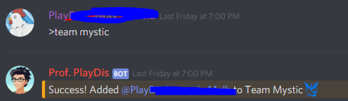

# PlayDis' bot

Discord bot i made for my pokemongo group

using discord.js

## Current functionality

 * Sends a welcome direct message to new discord members
   * customisable via config or welcomeDM command
   * {user} to mention the new member
   * {server} to include the server name
 * Auto assign a role to new members
   * can be useful for role management
   * set via config command
  * set command prefix 
   * via config command
 *   
 * members can self assign a team role
   * mystic, instinct, valor
   * 
 * register Trainer Code to a local sqlite database and also to a Google Sheets spreadsheet
   * also ensures no dupe entries from same discord member
   * https://www.npmjs.com/package/google-spreadsheet
   * https://github.com/JoshuaWise/better-sqlite3
 * integrated pokestop/gym search functionality from local data file
   * https://github.com/bragef/pidgey 
   * 
 * 12 hour in-game weather predictions 
   * automated run by https://www.npmjs.com/package/node-schedule
   * data extracted from Accuweather API
   * 
 * 5 second command cooldown to avoid spam
   * 
 * display number of members in each team
   * 
 * clear previous 10 messages (Server Owner only)

